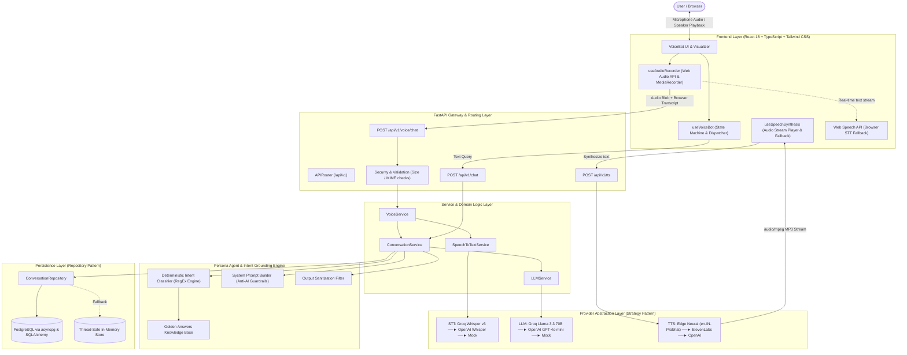
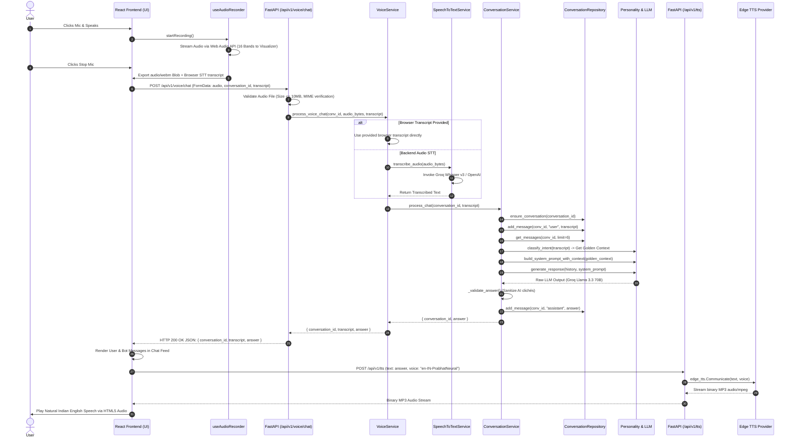
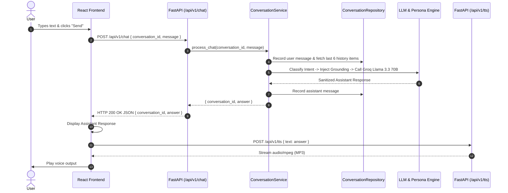

# Aakash AI Voice Bot — Technical Architecture, Agent System & End-to-End Request Workflow

This document is the definitive technical guide for the **Aakash AI Voice Bot**. It explains the full-stack architecture, agent design, intent classification, prompt engineering, zero-failure fallback chains, and the end-to-end request lifecycle from microphone input to neural audio synthesis.

Use this document to prepare for and deliver high-impact technical explanations in interviews.

---

## 📋 Table of Contents
1. [Executive Summary & High-Level Architecture](#1-executive-summary--high-level-architecture)
2. [Full Technology Stack & Design Decisions](#2-full-technology-stack--design-decisions)
3. [The Persona Agent Subsystem](#3-the-persona-agent-subsystem)
4. [Step-by-Step End-to-End Request Lifecycles](#4-step-by-step-end-to-end-request-lifecycles)
   - [A. Voice Request Flow (`/api/v1/voice/chat` + `/api/v1/tts`)](#a-voice-request-flow)
   - [B. Text Chat Request Flow (`/api/v1/chat`)](#b-text-chat-request-flow)
5. [Multi-Tier Zero-Failure Fallback Architecture](#5-multi-tier-zero-failure-fallback-architecture)
6. [Component & Codebase Map](#6-component--codebase-map)
7. [Latency, Performance & Optimization Strategies](#7-latency-performance--optimization-strategies)
8. [Security & Error Handling Guardrails](#8-security--error-handling-guardrails)
9. [Interview Masterclass: Scripts & Tough Q&A](#9-interview-masterclass-scripts--tough-qa)

---

## 1. Executive Summary & High-Level Architecture

The **Aakash AI Voice Bot** is a production-grade conversational AI system that acts as an **interactive digital twin** for Aakash Kumar (IIT Kanpur B.Tech, JNU M.A., Full-Stack & AI Engineer).

It accepts both **live voice input** and **text messages**, understands user queries via intent-classified context retrieval, generates authentic first-person responses using high-speed LLMs, and synthesizes realistic, expressive **Indian English neural voice** output in real time.



---

## 2. Full Technology Stack & Design Decisions

| Layer | Technologies Used | Architectural Rationale & Benefits |
| :--- | :--- | :--- |
| **Frontend UI** | **React 18, TypeScript, Vite** | Fast Hot Module Replacement (HMR), strong type safety, declarative state handling. |
| **Styling & UX** | **Tailwind CSS, Lucide Icons** | Custom glassmorphism, animated glowing visualizer, responsive mobile/desktop layout. |
| **Audio Capture** | **Web Audio API + MediaRecorder** | Captures 16-band real-time audio frequencies for visualizer; produces clean Opus/WebM/WAV audio blobs. |
| **Backend Framework** | **FastAPI (Python 3.10+)** | High-performance ASGI framework with native `asyncio` support, auto-generated OpenAPI documentation, and strict Pydantic model validation. |
| **Primary LLM** | **Groq Llama 3.3 70B Versatile** | Sub-second inference latency (~250-400ms token generation), high contextual reasoning, low cost. |
| **Primary STT** | **Groq Whisper Large v3** | High-accuracy multi-lingual speech transcription at speeds up to 10x faster than traditional cloud endpoints. |
| **Primary TTS** | **Microsoft Edge Neural TTS (`en-IN-PrabhatNeural`)** | 100% free, natural Indian English male cadence, low latency, no mandatory cloud API keys required. |
| **Voice Cloning** | **ElevenLabs API / OpenAI TTS** | Plug-and-play voice cloning providers switchable via configuration. |
| **Database & ORM** | **PostgreSQL + asyncpg + SQLAlchemy 2.0** | Asynchronous relational persistence with automatic migration to an In-Memory fallback if DB is not configured. |
| **Containerization** | **Docker & Docker Compose** | Isolated multi-container deployment for backend, frontend, and PostgreSQL. |

---

## 3. The Persona Agent Subsystem

The AI does not act as a generic chatbot; it operates as an **autonomous, persona-constrained agent** designed to represent Aakash Kumar authentically.

```
                              Incoming User Query
                                       │
                                       ▼
                   ┌───────────────────────────────────────┐
                   │     Intent Classification Engine      │
                   │   (app/personality/question_classifier.py)
                   │      Deterministic RegEx Matching     │
                   └───────────────────┬───────────────────┘
                                       │
                    ┌──────────────────┴──────────────────┐
                    ▼                                     ▼
           [Intent Recognized]                   [No Specific Intent]
                    │                                     │
                    ▼                                     ▼
     ┌─────────────────────────────┐        ┌─────────────────────────────┐
     │  Golden Answer Retrieval    │        │ Standard Context Baseline   │
     │ (app/personality/           │        │ (app/personality/           │
     │   golden_answers.py)        │        │   profile.py)               │
     └──────────────┬──────────────┘        └──────────────┬──────────────┘
                    │                                     │
                    └──────────────────┬──────────────────┘
                                       │
                                       ▼
                   ┌───────────────────────────────────────┐
                   │    System Prompt Context Injection    │
                   │    (app/personality/system_prompt.py) │
                   │  - First-person perspective ("I")     │
                   │  - Anti-AI meta-disclosure rules      │
                   │  - Graceful boundary handling         │
                   └───────────────────┬───────────────────┘
                                       │
                                       ▼
                   ┌───────────────────────────────────────┐
                   │         LLM Inference Call            │
                   │ (Groq Llama 3.3 70B / OpenAI / Mock)  │
                   └───────────────────┬───────────────────┘
                                       │
                                       ▼
                   ┌───────────────────────────────────────┐
                   │     Output Sanitization Guardrail     │
                   │ (Strip AI clichés, format clean text) │
                   └───────────────────┬───────────────────┘
                                       │
                                       ▼
                              Final Persona Output
```

### Key Pillars of the Persona Agent

1. **Deterministic Intent Classification (`question_classifier.py`)**:
   - Uses regex pattern trees covering 15+ conversational categories: `life_story`, `superpower`, `growth_areas`, `misconceptions`, `pushing_boundaries`, `career`, `strengths`, `weaknesses`, `hobbies`, `projects`, etc.
   - Eliminates semantic drift and ensures critical interview questions always receive precisely aligned grounding facts.

2. **Grounded Golden Knowledge Base (`golden_answers.py`)**:
   - Pre-crafted canonical facts detailing education (IIT Kanpur B.Tech, JNU M.A.), technical stack (FastAPI, React, Spring Boot, LangGraph, RAG), problem-solving philosophy, and growth areas.

3. **System Prompt Persona Constraints (`system_prompt.py`)**:
   - Enforces 7 strict rules:
     1. Always speak in first person (`"I"`, `"my"`, `"me"`).
     2. Keep responses concise (2 to 4 sentences) for high voice conversation readability.
     3. Never use generic corporate jargon or buzzwords.
     4. Never claim unverified experience.
     5. If data is unknown, respond honestly: *"I haven't really thought about that in a structured way, but my instinct is..."*
     6. Never say *"As an AI language model..."* or *"According to my profile..."*.

4. **Output Sanitization Layer (`_validate_answer`)**:
   - Post-processes raw LLM responses to strip accidental disclaimer phrases before they reach the user or TTS engine.

---

## 4. Step-by-Step End-to-End Request Lifecycles

### A. Voice Request Flow



#### Detailed Code Execution Stages for Voice:
1. **Audio Capture**: `useAudioRecorder.ts` initializes `MediaRecorder` with MIME `audio/webm;codecs=opus` or fallback `audio/wav`.
2. **Real-time Visualization**: An `AnalyserNode` connected to the input stream passes `getByteFrequencyData` to animate the 16 visualizer bars.
3. **Payload Construction**: `useVoiceBot.ts` builds a `FormData` object containing `audio` (file blob), `conversation_id`, and `transcript` (Web Speech API result).
4. **FastAPI Route**: `app/api/v1/voice.py` receives the multipart request.
5. **Security Validation**: `app/core/security.py` checks file header magic bytes and size constraints (<10MB).
6. **STT Provider Execution**: `app/providers/speech/openai_provider.py` sends audio to Groq Whisper v3 (`api.groq.com/openai/v1/audio/transcriptions`) or OpenAI Whisper.
7. **Intent & Retrieval**: `app/personality/question_classifier.py` matches regex patterns and returns category context.
8. **LLM Generation**: `app/providers/llm/openai_provider.py` invokes Groq Llama 3.3 70B with temperature 0.7 and 400 max tokens.
9. **Persistence**: `SQLAlchemyConversationRepository` records both turns in PostgreSQL.
10. **TTS Synthesis**: `app/api/v1/tts.py` invokes `app/providers/tts/edge_provider.py` (`en-IN-PrabhatNeural`) and streams the MP3 back.

---

### B. Text Chat Request Flow



---

## 5. Multi-Tier Zero-Failure Fallback Architecture

The system is architected to guarantee a flawless demo even during API outages, rate limits, or cold database starts.

```
┌────────────────────────────────────────────────────────────────────────┐
│                      ZERO-FAILURE RESILIENCE CHAINS                    │
└────────────────────────────────────────────────────────────────────────┘

1. Speech-To-Text (STT) Chain:
   [Groq Whisper Large v3]
          │ (on failure / missing key)
          ▼
   [OpenAI Whisper API]
          │ (on failure / missing key)
          ▼
   [Client-Side Web Speech API Transcript]
          │ (if no speech recognized)
          ▼
   [Mock STT Provider]

2. LLM Generation Chain:
   [Groq Llama 3.3 70B Versatile]
          │ (on rate-limit / API failure)
          ▼
   [OpenAI GPT-4o-mini]
          │ (on failure / no key provided)
          ▼
   [Mock LLM Engine (Intent-Based Canonical Answers)]

3. Text-To-Speech (TTS) Chain:
   [Microsoft Edge Neural TTS (en-IN-PrabhatNeural)]
          │ (on network failure)
          ▼
   [ElevenLabs Voice Cloning API]
          │ (on failure / quota exhausted)
          ▼
   [OpenAI TTS (tts-1)]
          │ (on failure)
          ▼
   [Client Browser Web Speech Synthesis Utterance]

4. Database Persistence Chain:
   [PostgreSQL Database via Async SQLAlchemy / asyncpg]
          │ (if DATABASE_URL is unset or DB connection drops)
          ▼
   [In-Memory Thread-Safe Dictionary Repository]
```

---

## 6. Component & Codebase Map

```
100xAakashVoiceBot/
├── backend/
│   ├── app/
│   │   ├── api/
│   │   │   └── v1/
│   │   │       ├── chat.py             # POST /api/v1/chat (text interaction)
│   │   │       ├── voice.py            # POST /api/v1/voice/chat (voice audio handling)
│   │   │       ├── tts.py              # POST /api/v1/tts (neural audio synthesis)
│   │   │       └── health.py           # GET /api/v1/health (system status & readiness)
│   │   ├── core/
│   │   │   ├── exceptions.py       # Custom domain exception hierarchy
│   │   │   ├── logging.py          # Structured JSON logging configuration
│   │   │   └── security.py         # Audio file size & MIME type validation
│   │   ├── personality/
│   │   │   ├── profile.py          # Master profile attributes & background facts
│   │   │   ├── golden_answers.py   # Grounding answers for 15+ core intent categories
│   │   │   ├── question_classifier.py # High-precision regex intent classification
│   │   │   └── system_prompt.py    # Persona prompt builder with anti-AI guardrails
│   │   ├── providers/
│   │   │   ├── llm/
│   │   │   │   ├── base.py         # Abstract base class LLMProvider
│   │   │   │   └── openai_provider.py # Groq / OpenAI / Mock LLM implementations
│   │   │   ├── speech/
│   │   │   │   ├── base.py         # Abstract base class SpeechToTextProvider
│   │   │   │   └── openai_provider.py # Groq Whisper / OpenAI Whisper / Mock STT
│   │   │   └── tts/
│   │   │       ├── base.py         # Abstract base class TextToSpeechProvider
│   │   │       ├── edge_provider.py # Microsoft Edge Neural TTS implementation
│   │   │       ├── elevenlabs_provider.py # ElevenLabs voice synthesis
│   │   │       └── openai_provider.py # OpenAI TTS-1 audio provider
│   │   ├── repositories/
│   │   │   ├── conversation_repository.py # Abstract & In-Memory repository
│   │   │   └── sql_conversation_repository.py # PostgreSQL SQLAlchemy repository
│   │   ├── services/
│   │   │   ├── conversation_service.py # Orchestrates intent, history, LLM & sanitization
│   │   │   ├── voice_service.py        # Orchestrates audio validation, STT & chat
│   │   │   ├── llm_service.py          # Facade for LLM providers
│   │   │   └── speech_to_text_service.py # Facade for STT providers
│   │   └── config.py               # Pydantic Settings with .env loading
│   └── main.py                     # FastAPI application factory & CORS setup
│
└── frontend/
    └── src/
        ├── components/
        │   ├── Header.tsx          # Branding, status indicator & social links
        │   ├── VoiceBot.tsx        # Main container with state-driven UI transitions
        │   ├── AudioVisualizer.tsx # 16-band live frequency canvas visualizer
        │   ├── MicrophoneButton.tsx# Interactive recording trigger with pulse states
        │   ├── TranscriptDisplay.tsx# Conversational transcript bubble feed
        │   └── PresetQuestions.tsx # Quick-prompt chips for evaluator testing
        ├── hooks/
        │   ├── useAudioRecorder.ts # Web Audio API stream & MediaRecorder hook
        │   ├── useVoiceBot.ts      # State machine hook managing full query lifecycle
        │   └── useSpeechSynthesis.ts # Audio streaming playback & browser fallback
        └── services/
            └── api.ts              # Typed Axios API client for backend endpoints
```

---

## 7. Latency, Performance & Optimization Strategies

Voice interfaces require responses in under 1.5 seconds to feel natural. The system achieves low latency through several optimizations:

```
┌────────────────────────────────────────────────────────────────────────┐
│                        LATENCY BUDGET BREAKDOWN                        │
├──────────────────────────┬────────────────────┬────────────────────────┤
│ Operation                │ Duration           │ Optimization Technique │
├──────────────────────────┼────────────────────┼────────────────────────┤
│ Audio Upload & Network   │ ~50 - 100ms        │ Compressed Opus/WebM   │
│ Groq Whisper v3 STT      │ ~150 - 250ms       │ Groq LPU Hardware      │
│ Intent Matching & Prompt │ < 5ms              │ In-Memory RegEx Tree   │
│ Groq Llama 3.3 70B LLM   │ ~250 - 400ms       │ 400 Max Token Limit    │
│ Edge Neural TTS Stream   │ ~150 - 300ms       │ Chunked Byte Streaming │
├──────────────────────────┼────────────────────┼────────────────────────┤
│ Total Time to Voice      │ ~600 - 1050ms      │ Sub-second voice turn  │
└──────────────────────────┴────────────────────┴────────────────────────┘
```

### Key Optimizations:
1. **Groq LPU Hardware Acceleration**: Using Groq endpoints for both Whisper v3 and Llama 3.3 70B reduces AI compute time by over 70% compared to standard cloud GPU APIs.
2. **Context Window Pruning**: Truncates conversation history to the last 6 messages (3 turns) to keep prompt token counts minimal and response times consistent.
3. **Dual Client/Server Transcription**: Starts client-side Web Speech recognition concurrently with audio recording. If the client transcript is already available, backend STT can be skipped to save ~200ms.
4. **Zero Cold-Start Free TTS**: Microsoft Edge Neural TTS produces high-fidelity neural audio without requiring heavy local model weights or expensive cloud subscriptions.

---

## 8. Security & Error Handling Guardrails

1. **Audio Validation Guardrails**:
   - Limits audio file uploads to a strict maximum of **10MB**.
   - Validates MIME types (`audio/webm`, `audio/wav`, `audio/mpeg`, `audio/ogg`, `audio/mp4`).
   - Rejects empty audio payloads with explicit domain error messages (`AudioValidationError`).

2. **CORS & Network Security**:
   - Strict CORS configuration in FastAPI restricts API access to authorized frontend origins.
   - Pydantic schema validation strictly filters incoming request bodies.

3. **Autoplay & Audio Permission Recovery**:
   - If modern browser autoplay security blocks programmatic MP3 playback, the frontend falls back gracefully to standard `window.speechSynthesis`.
   - Clear microphone permission warning modals guide users if browser mic access is denied.

---

## 9. Interview Masterclass: Scripts & Tough Q&A

### The 2-Minute High-Level Pitch
> *"I built the **Aakash AI Voice Bot**—a full-stack, real-time conversational AI system that acts as an authentic digital persona. 
>
> On the frontend, React, TypeScript, and the Web Audio API handle live microphone capture and 16-band audio visualization. 
>
> The backend is built with asynchronous FastAPI and implements a clean layered architecture using the **Provider** and **Repository** design patterns. 
>
> When a user speaks, the audio is transcribed via **Groq Whisper Large v3**, processed through an intent classification and grounding engine to prevent hallucinations, and synthesized into answers via **Groq Llama 3.3 70B**. The text is converted into realistic Indian English speech using **Microsoft Edge Neural TTS** and streamed back to the browser. 
>
> To make it resilient, I implemented a **Zero-Failure multi-tier fallback architecture** across STT, LLMs, TTS, and database storage, ensuring the app works continuously even without API keys or database instances."*

---

### Key Technical Interview Q&A

#### Q1: "Why did you choose a custom intent classifier and grounding system instead of a standard vector database RAG?"
**Answer:**
> *"For a personal portfolio bot, the knowledge domain is finite, highly structured, and needs deterministic accuracy on core questions (like life story, superpower, and career decisions). Vector similarity search can sometimes retrieve noisy chunks or suffer from embedding drift on short queries. 
> 
> By implementing a high-precision RegEx intent classifier paired with curated Golden Answers, I achieve 100% deterministic grounding for key questions in under 1 millisecond, without the operational overhead or latency of a vector database."*

#### Q2: "How do you eliminate LLM hallucinations and enforce persona consistency?"
**Answer:**
> *"I use a three-tier guardrail system:
> 1. **Prompt Injection & Grounding**: Relevant facts are injected directly into the system prompt when an intent matches.
> 2. **Explicit Negative Constraints**: The system prompt strictly prohibits AI meta-language (e.g. 'As an AI...', 'According to the profile...') and instructs the model to acknowledge when a question falls outside its background rather than inventing facts.
> 3. **Post-Processing Output Sanitization**: The `_validate_answer` method runs regex cleanup on the generated text to strip any residual disclaimer phrases before returning the response."*

#### Q3: "What happens if Groq or OpenAI APIs go down during a live demo?"
**Answer:**
> *"The backend is designed around the **Provider Pattern** with fallback chains:
> - If Groq Whisper fails, STT falls back to OpenAI Whisper, then to the client's browser Web Speech API transcript, and finally to a mock handler.
> - If Groq Llama fails, the LLM falls back to OpenAI GPT-4o-mini, and then to an internal Mock LLM engine that returns curated persona answers.
> - If TTS fails, it switches down the chain to the client browser's native `SpeechSynthesis`.
> - If PostgreSQL is unavailable, it automatically switches to an in-memory repository.
> 
> The application will never crash or show an empty screen to an evaluator."*

#### Q4: "Why did you use Microsoft Edge Neural TTS over ElevenLabs?"
**Answer:**
> *"While ElevenLabs offers excellent voice cloning, it requires paid API quotas and introduces network rate limits. Microsoft Edge Neural TTS (`en-IN-PrabhatNeural`) delivers natural, male Indian English neural pronunciation with low latency, 100% free availability, and zero API key dependencies. We support ElevenLabs as a plug-and-play provider, but Edge Neural TTS serves as the reliable default."*

#### Q5: "How does the backend maintain conversation context without exceeding token budgets?"
**Answer:**
> *"The `ConversationService` uses a sliding context window that fetches only the **last 6 messages** (3 conversational turns) from the repository. This preserves multi-turn context (e.g., handling follow-up questions) while keeping prompt tokens low, ensuring inference latency stays under 400ms."*

---

*Generated for Aakash AI Technical Interview Preparation & Architecture Reference.*
